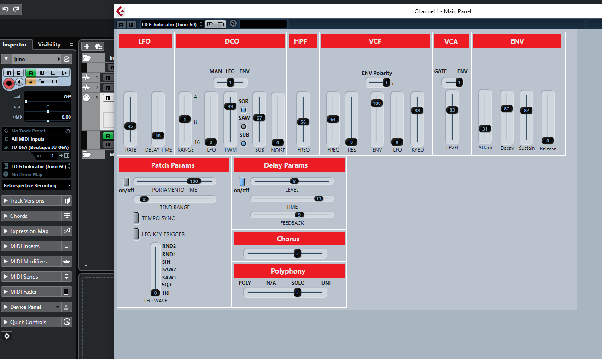
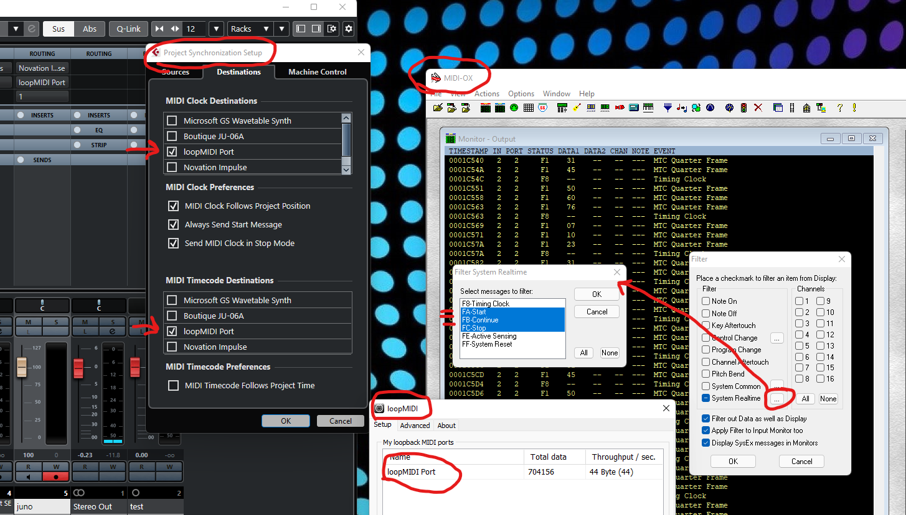

# JU-06A Cubase Files

These are custom Cubase panels and midi device files for Cubase 11 Pro. 

## Example

# Notes

* In the JU-06A patch backup files, most values range from 0-255 instead of the typical MIDI CC range of 0-127. To convert to a MIDI CC value, I've been dividing the value by 2 and rounding the result up to the nearest whole value.
* Delay parameters only go from 0-15 and do not need to be scaled.
* To replicate a particular factory preset in Cubase, you need to find the patch in the backup folder and set the values on the panel accordingly. Then you can create a snapshot of the panel.
* There is no MIDI CC that can switch it from 60 to 106.

# Prevent Sequencer from Starting

When Cubase is set as the master clock source and is configured to send MTC messages to the JU-06a,
the sequencer will automatically start playing when the Cubase transport is played. This might be useful in some situations,
but for general payback and recording, it can be a nuisance. However, it is possible to keep the JU-06a's clock
synced with Cubase and prevent the sequencer from starting when clicking the play button.

## Procedure

1. Download and install [MIDI-OX](http://www.midiox.com/) and [loopMIDI](http://www.tobias-erichsen.de/software/loopmidi.html).
2. Open loopMIDI and create a port.
3. Open MIDI-OX.
4. Open the MIDI Devices panel and select the loopMIDI port you created as a MIDI input. Select the JU-06a as the MIDI output. Click OK.
5. In the options menu, enable the "Pass SysEX" toggle.
6. In the options menu, click the "MIDI Filter..." option to open the filter editor.
7. Filter the System Realtime `FA`, `FB`, and `FC` messages. They are start, continue and stop respectively.
8. Ensure "Filter out Data as well as Display," and "Apply Filter to Input Monitor too" are selected.
9. Click OK. Now the filter is enabled, and you can leave MIDI-OX and loopMIDI open in the background.
10. Open Cubase.
11. Open the Project Synchronization Setup panel and select the loopMIDI port for MIDI clock and timecode destinations. **Do not select the JU-06a or any device that has a route to it.**.
12. Verify the sequencer does not start when clicking the transport's play button.
13. Verify that the JU-06a's tempo is changed when you change the project's tempo. You can test this by using the arpeggiator or sequencer and listening for tempo changes.

